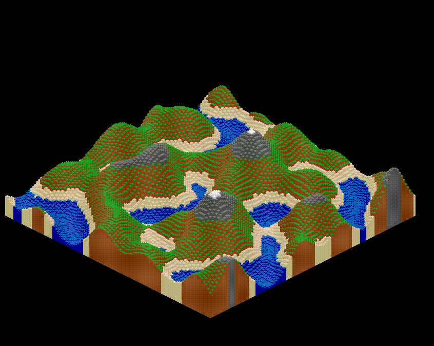
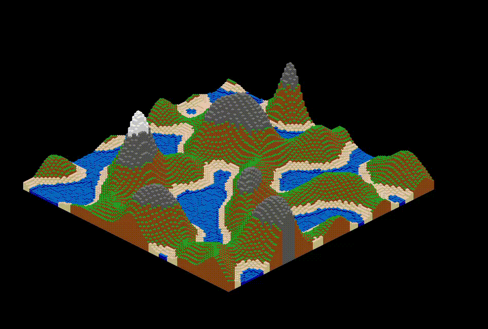

# Isometric Tile Simulator

## Overview
This project was a short attempt at creating rendered chunks in C++ using SFML. The terrain is pseudo-isometric, using voxels for the actual grid and perlin noise for the generation. Be warned, this is not super CPU intensive but the rendering isn't completely optimized ( I optimized it enough so that it runs at least at 60 FPS) and can be a memory hog. This serves no purpose other than self practice and showing off some cool graphical rendering at a lower level.

I initially made my own perlin noise function, however, it wasn't amazingly optimized despite working, and I wanted a more robust randomization so I used the FastNoise library instead to simulate the actual terrain generation.

## Features
Randomly generated terrain chunk inspired by isometric graphics and perlin noise. The water is animated :)
## Prerequisites
- A C++ compiler with C++20 support.
- [SFML 2.5+](https://www.sfml-dev.org/) installed on your system.
- [CMake](https://cmake.org/) (version 3.30 or above is recommended).
- An IDE such as [CLion](https://www.jetbrains.com/clion/) is optional but recommended.
## Building the Project

Clone Repo:
 ```bash
   git clone https://github.com/mangokip/IsometricTileSim.git
   cd IsometricTileSim
```
Build:
```bash
  mkdir build
  cd build
  cmake ..
  make
  ./IsometricTileSim  
```

## Demo



