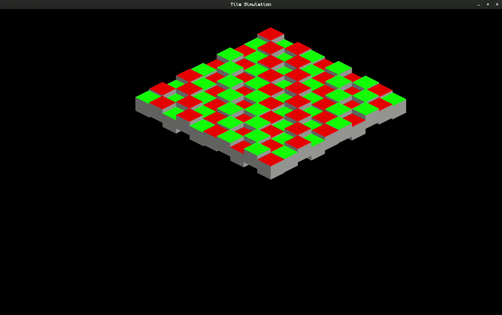

# Isometric Tile Simulator

## Overview
I plan to turn this into a larger-scale isometric terrain generator. This is merely a hobby project using C++ and SFML. My goal for completion will be a randomly generated map that can be
moved around to show new randomly generated parts of an isometric map.

## Features
Haven't really done much, but so far you can just view a cool little block map oscillating based off the function for sin.

## Prerequisites
- A C++ compiler with C++20 support.
- [SFML 2.5+](https://www.sfml-dev.org/) installed on your system.
- [CMake](https://cmake.org/) (version 3.30 or above is recommended).
- An IDE such as [CLion](https://www.jetbrains.com/clion/) is optional but recommended.
## Building the Project

Clone Repo:
 ```bash
   git clone https://github.com/your-username/IsometricTileSim.git
   cd IsometricTileSim
```
Build:
```bash
  mkdir build
  cd build
  cmake ..
  make
  ./IsometricTileSim  
```

## Progress
